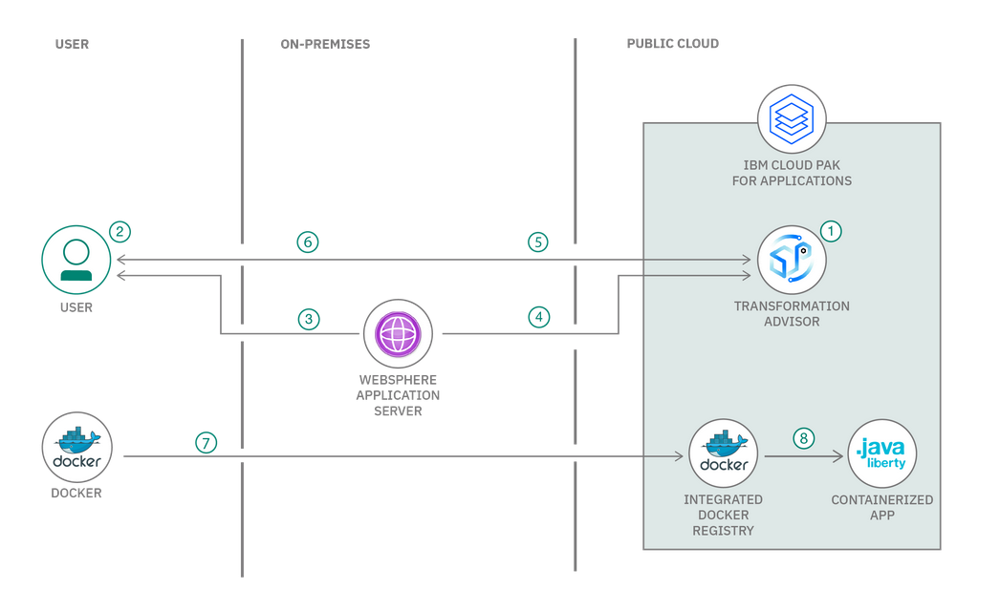

## Short Name

Modernize apps with IBM Transformation Advisor tool on IBM Cloud Pak for Application

## Short Description

Transform your traditional on-premises app and deploy it as a containerized app on an OpenShift Platform

## Author
Balaji Kadambi (https://developer.ibm.com/profiles/bkadambi/)

Shikha Maheshwari (https://developer.ibm.com/profiles/shikha.mah/)

## Code
https://github.com/IBM/migrate-app-to-openshift-using-cp4a

## Video
NA

## Summary

If you have existing on-premises WebSphere Application Server apps and can benefit by moving them to the cloud, 
this code pattern is for you. A simple demo app shows how to run a custom data collector to analyze an app and provide
recommendations, cost estimates, and detailed reports to help with your transformation project using IBM Cloud Pak for Application. You see how to generate the artifacts you need and get your application deployed and running in a Liberty container on the OpenShift Platform.

## Description

This code pattern uses the IBM Transformation Advisor from IBM Cloud Pak for Application to evaluate an on-premises traditional WebSphere Application Server application for deployment on OpenShift Container Platform. See how to use the Transformation Advisor to get recommendations, how to download the generated migration bundle and use its artifacts to deploy the app in a Liberty container running on OpenShift Platform.

A sample web app demonstrates a migration from an on-premises application to the OpenShift Platform using IBM Cloud Pak for Application.

When you use this code pattern, you learn how to complete the following tasks:

 * Use Transformation Advisor from IBM Cloud Pak for Application to create a custom data collector.
 * Run the custom data collector to analyze a traditional WebSphere Application Server application.
 * Review the Transformation Advisor reports to see migration complexity, cost, and recommendations.
 * Generate artifacts to containerize the app.
 * Move the modernized app to the OpenShift Platform on IBM Cloud using a generated migration bundle.

## Flow

1. Developer accesses IBM Transformation Advisor on IBM Cloud Pak for Application
2. Developer downloads a custom Data Collector from Transformation Advisor
3. Developer runs the Data Collector on the traditional WebSphere Application Server host where application (to be migrated) is running
4. Data Collector analysis is uploaded (automatically or manually)
5. Developer reviews recommendations in Transformation Advisor and creates a migration bundle
6. Developer downloads migration bundle
7. Developer uses Docker to build an image and upload it to OpenShift Docker Registry
8. Developer creates an app using the pushed image and runs the containerized app

## Included components

* [IBM Cloud Pak for Application](https://www.ibm.com/cloud/cloud-pak-for-applications): The IBM Cloud Pak for Applications provides a complete and consistent experience to speed development of applications. You can easily modernize your existing applications with IBM integrated tools and develop new cloud-native applications faster for deployment on any cloud.

* [Transformation Advisor](https://www.ibm.com/in-en/marketplace/cloud-transformation-advisor): Not every workload should move to cloud. The right choice can yield large cost savings and speed time to market. The Transformation Advisor tool can help you decide.
   
* [WebSphere Liberty](https://www.ibm.com/cloud/websphere-liberty): A dynamic and easy-to-use Java EE application server, with fast startup times, no server restarts to pick up changes, and a simple XML configuration.

## Featured technologies

* [OpenShift Container Platform](https://www.openshift.com/): Red Hat OpenShift offers a consistent hybrid cloud foundation for building and scaling containerized applications.
* [Cloud](https://en.wikipedia.org/wiki/Cloud_computing): Accessing computer and information technology resources through the Internet.
* [Containers](https://www.ibm.com/cloud/learn/containers): Virtual software objects that include all the elements that an app needs to run.
* [Java](https://www.w3schools.com/java/java_intro.asp): A secure, object-oriented programming language for creating applications.

## Links

* [Build a secure microservices based banking application](https://developer.ibm.com/patterns/build-a-secure-microservices-based-application-with-transactional-flows/)
* [Java EE Application Modernization with OpenShift](https://developer.ibm.com/patterns/jee-app-modernization-with-openshift/)
* [Learn more about IBM Cloud Pak for Application](https://developer.ibm.com/series/ibm-cloud-pak-for-applications-video-series/)
